# ASX Asset Management

我在这个私有仓库中保留完整的资产管理研究代码，包括蒙特卡洛组合模拟、投资组合优化、新闻情绪分析、宏观经济调整，以及逐期只使用当时可得数据的按月滚动回测。我将数据读取、特征工程、客户分群、组合分析和结果输出整理为独立模块。

下面是我的完整中文项目报告，包含原有的全部 16 张图片和 4 处批注。我保留早期研究的内容，并用“研究说明”区分当时的判断与当前解释。

[中文报告 PDF](docs/project-summary-zh.pdf) · [中文版报告 Markdown](docs/project-summary-zh.md) · [原始报告 PDF](docs/project-summary.pdf) · [运行方法](#运行方法) · [滚动回测](#滚动回测) · [项目结构](#项目结构)

## 项目分析报告 A 部分

### 背景与介绍

我以数据工厂的前两个工作站为例，设计这个项目。

我的目标是通过筛选和计算现有数据（例如 Excel 文件），提取数据结构并形成可供分析的特征。

工作站 #1：ETL，即提取数据流、转换数据并加载数据。

工作站 #2：特征工程，即选择相关特征，重新组合特征，并提出新的特征需求。我从工作站 #1 的处理结果中选择数据，实现数据可视化和更深入的数据分析。

我使用的代码运行平台为 Spyder，Python 版本为 3.12；报告中展示程序运行时的输入与输出。

### 工作站 #1：ETL

> 批注 [渭何1]: 抓取、转化、提炼数据。加载不同形式的
> 数据流，通过网站提供的 API 得到数据，处理成为后续
> 想要的数据形式。

#### 工作内容

我在这一部分处理四份数据文件。

- 我使用 `ASX200top10.xlsx`，筛选十只股票的每日 `PX_LAST` 价格数据，再使用这个数据框计算 2015—2020 年约五年期间的平均日投资收益率。
- 我使用 `Client_Details.xlsx`，按年龄、风险和投资比例筛选客户群体。
- 我建立宏观经济数据框。
- 我将 JSON 新闻数据整理成数据框。

#### 数据输入

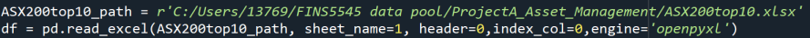

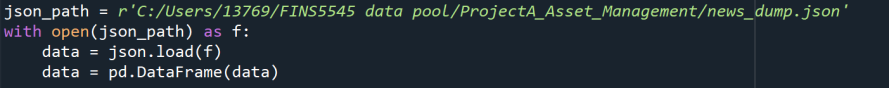

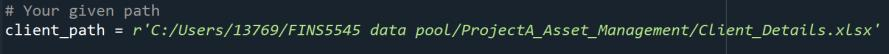

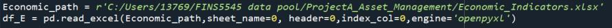

#### 数据筛选与计算

##### ASX200top20 数据的处理

我筛选十只股票在 2015—2020 年期间的每日价格，并计算平均日股价收益率。在计算收益率时，我删除 2015-03-30 对应的空值。

随后，我计算按随机权重投资这十只股票的加权平均收益率。

> 研究说明：我在早期报告的这个小标题中写作“ASX200top20”，实际输入文件为 `ASX200top10.xlsx`，分析对象是十只股票。

##### 客户资料的处理

我按以下条件分别筛选客户记录：风险等级为 4 及以上；年龄组编号小于 4；CSL 股票在资产配置中的比例超过 50%。

#### 数据输出

筛选完成后，我得到十只股票的数据框，以及这十只股票的预期平均收益信息。

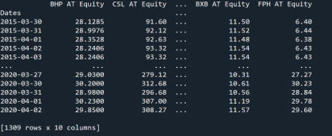

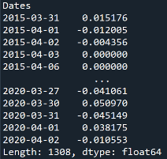

此外，我还建立以下数据框：客户资料数据框、JSON 新闻数据框和宏观经济数据框。

#### 工作站 #1 的定义

ETL 是 Extract、Transform、Load 的缩写，分别表示提取、转换和加载。这是一种数据处理方法：从不同来源提取数据，将其转换为标准化格式，再加载到数据库或数据仓库等目标系统，用于分析和报告。

### 工作站 #2：特征工程

> 批注 [渭何2]: 数据挖掘、数据可视化。1. 将资产的特征
> 提取出来，利用统计学的方法可视化数据特征。2. 根据
> 客户现有资产头寸，结合聚类分析算法，自动判断客户
> 风险偏好类型。

我的目标是掌握数据的一些特征，并通过可视化呈现这些特征。

#### 股票走势特征

最直接的方法是绘制股价图。我以工作站 #1 生成的十只股票数据框为基础，展示这些股票的价格走势。

从图中可以观察到，过去五年平均股价总体呈上升趋势，其中 CSL 的股价涨幅最大。我根据图中的波动情况判断，波动较大的股票似乎也有更大的涨幅，并将这一现象与“风险越高、回报越高”的投资理念联系起来。

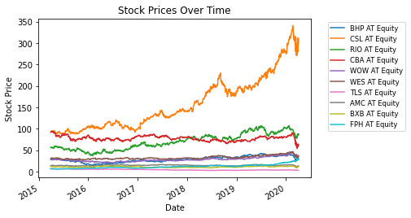

> 研究说明：这里记录的是我对历史图形的观察，不能据此推断高波动必然带来更高的实际收益，也不能把这段样本中的关系视为未来表现保证。

#### 收益率分布

我使用工作站 #1 得到的收益率序列，分别绘制收益率分布图和 QQ 图。

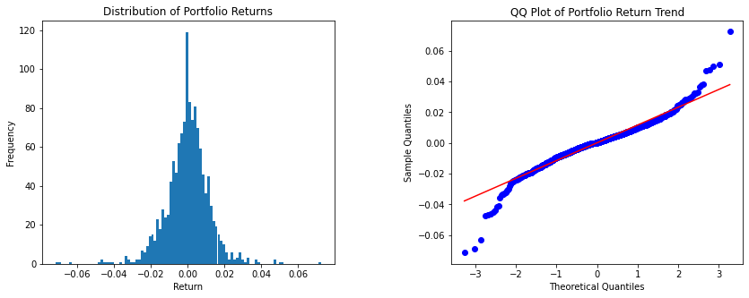

随后，我进一步检验收益率是否符合正态分布。

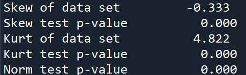

我在早期报告中将这一结果解释为“投资收益率满足正态分布（P 值 < 0.05）”。

> 研究说明：我在此保留当时的判断记录。对于以“数据服从正态分布”为原假设的正态性检验，`p < 0.05` 应表示在 5% 显著性水平下拒绝正态性假设，不能用来证明收益率服从正态分布；`p ≥ 0.05` 也不能证明正态性。我的当前解释见[方法与限制](docs/methodology.md)。

#### 年龄与风险偏好的分布

我根据客户资料中的数据，绘制客户的投资分布与年龄分布。

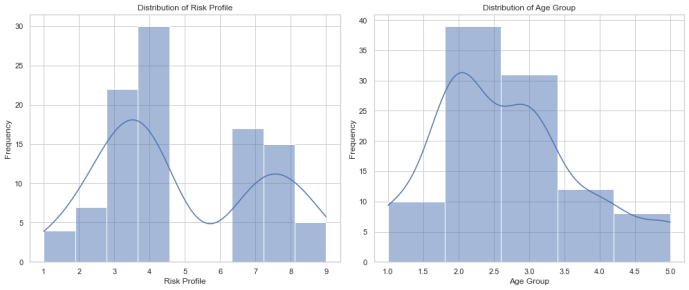

#### 新闻出现频率

我根据 JSON 文件，分析各家公司在新闻中出现的频率。

从图中可以看到，其中市值较大的公司被讨论得更多。

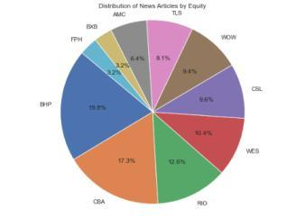

#### K-means 聚类分析

我使用 K-means 聚类分析，将客户群体分为三个不同的簇。

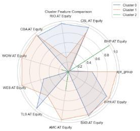

簇 0 包含 52 位客户，簇 1 包含 25 位客户，簇 2 包含 23 位客户。

**簇 0：**客户的平均年龄组编号最高，约为 3.29；投资组合在不同股票之间的配置较均衡。我认为，这一簇可能代表年龄较大的客户群体，其投资偏好更分散，并倾向于寻求稳定的投资。

**簇 1：**客户的平均年龄组编号较低，约为 2.48；其中对 RIO AT Equity 的投资比例明显高于其他股票。我在报告中将其解释为可能寻求特定行业或公司较高收益的资深客户群体。

**簇 2：**客户的平均年龄组编号最低，约为 1.57；对 BHP AT Equity 的投资比例很高，对其他股票的投资比例较低，尤其几乎没有投资 BXB AT Equity 和 FPH AT Equity。这可能反映一个较年轻的客户群体，其投资高度集中于单只股票或单一行业。

#### 工作站 #2 的定义

特征工程是利用领域知识，从原始数据中创建新特征，使机器学习算法更有效地工作。它将原始数据转换成有意义的变量，以帮助改善预测模型的表现。

这包括创建新的数据列、修改现有列、组合不同来源的数据，或对类别变量进行编码。目标是为机器学习模型提供扎实、相关的输入，以提高其准确性和整体表现。

## 项目分析报告 B 部分

### 介绍

我在这一部分设计数据工厂的后两个工作站。相比前面的数据处理与特征分析，这部分更具挑战性。

我的目标是根据客户的风险偏好配置投资组合，并随着经济条件和市场信息的变化调整组合配置。最后，我尝试对市场走势（指数）建模并进行预测。

工作站 #3：模型设计。我建立模型，帮助客户配置投资组合。

工作站 #4：模型实施。我实施模型，并设计一套服务客户的工作流程。

我使用的代码运行平台为 Spyder，Python 版本为 3.12；报告中展示程序成功运行时的输入与输出。

### 工作站 #3：模型设计

> 批注 [渭何3]: 1. 蒙特卡洛模拟
> 2. 最优化资产组合模型
> 3. ARIMA 判断股指
> 4. 基于 NLP 模型的市场情感分析

#### 工作内容

我在这一部分建立多个模型，帮助客户优化资产配置。

- 我使用蒙特卡洛模拟，以随机权重生成组合的风险与收益分布。
- 我构建有效前沿，寻找相同风险水平下收益最大的组合，并据此对照蒙特卡洛模拟中的组合结果。
- 我将风险偏好与投资组合进行匹配。
- 我结合市场信息与经济指标，对投资组合进行调整。
- 我使用 ARIMA 预测市场走势（指数）。

#### 模型设计与目标

##### 1. 蒙特卡洛模拟

我随机生成不同资产权重下的投资组合，初步探索风险与收益的边界。这种模拟用于展示普通客户在没有优化算法帮助时，组合配置可能存在的局限。（Harrison, 2010）

##### 2. 投资组合优化模型

我构建有效前沿，目的是展示在优化算法下可以达到的收益与风险边界：在给定风险下争取最大收益，或在给定收益下争取最小风险。（Bailey & , 2012）

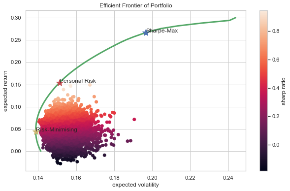

##### 3. ARIMA

我使用 ARIMA 预测市场走势（指数）。

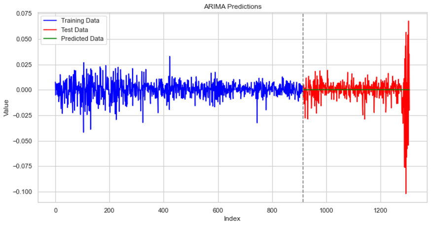

##### 4. NLP（与 OLS 模型结合）

我使用 OLS 预测经济指标对市场的影响，并根据经济因素估计当前股价的变化。

> 研究说明：我保留早期报告中“NLP（与 OLS 模型结合）”的标题；其中这段文字实际描述的是宏观经济 OLS 回归。当前实现将宏观回归与 NLP 新闻情绪分析作为两个独立模块，NLP 模块本身不使用 OLS，具体计算见[方法与限制](docs/methodology.md)。

##### 5. 情绪分析

我对已发布的信息进行情绪分析与分类。在模型设计中，我将正面新闻理解为有利于公司股价的信号，将负面新闻理解为可能导致公司股价下跌的信号。（Chowdhury, et al., 2014）

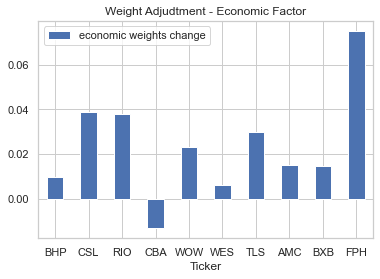

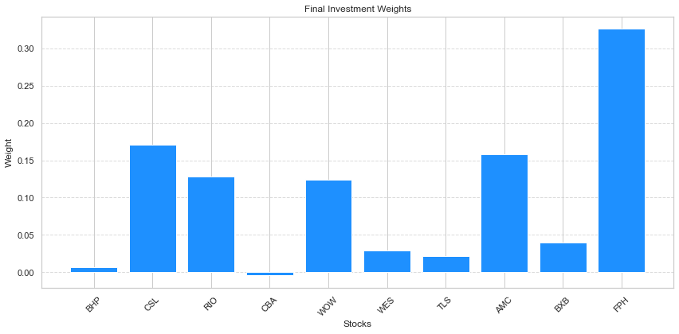

> 研究说明：新闻情绪与股价方向之间的关系是我在此采用的建模假设；这两张历史结果图本身不能证明情绪评分对未来收益具有预测能力。

#### 模型假设

##### 市场有效性假设

这一假设与有效前沿和蒙特卡洛模拟紧密相关。市场有效性假设认为，资产价格已经反映所有可获得的信息；我将其作为使用这些方法进行投资决策的基础假设。

##### 风险偏好与约束满足

我的模型假设，投资者的风险偏好可以被准确量化，并映射到具体的投资组合策略。这与通过组合优化实现最大夏普比率或最小方差密切相关。

##### 情绪分析的准确性

我假设从财经新闻中得到的情绪分数能够准确反映市场情绪，并且这些情绪对股票价格的影响具有一定可预测性。这是根据情绪分析调整投资组合权重的重要前提。

#### 计算速度与准确性问题

当前模型仅应用于十只股票。未来纳入更多股票时，计算速度可能下降；在大规模数据集或模拟次数增加的情况下，这一问题尤其明显，蒙特卡洛模拟就是其中的例子。

##### 准确性与敏感性

模型涉及多个参数，其准确性受到市场有效性、收益率正态分布等假设的影响。当实际数据偏离这些假设时，预测可能不准确，组合配置也可能偏离最优结果。

此外，模型对财经新闻情绪、经济指标等输入数据的准确性较为敏感。这增加了模型的复杂性，也带来了潜在的误差来源。

#### 模型实施的预期

##### 风险类别定义

**高风险组：**愿意接受较大波动，以争取潜在更高收益的客户。

**风险中性组：**希望在风险与收益之间取得平衡的客户。

**低风险组：**偏好稳定和较低波动，即使因此接受较低收益的客户。

##### 最优风险与收益的计算

我计划使用历史数据，为每个风险类别构建投资组合，在给定风险水平下尽可能提高预期收益。例如，高风险组可以使用夏普比率衡量相对于波动率的收益，低风险组则可以将降低波动率作为目标。

##### 根据客户偏好进行动态调整

我计划在每个风险组内部，根据具体客户的风险偏好调整投资组合。例如，风险中性组中的某位客户愿意接受略高风险时，我可以在其组合中增加风险较高的资产。

以风险中性组为例，我可以根据市场情绪调整投资权重：使用财经新闻情绪分析判断市场情绪，再相应调整风险中性组合中的投资比例。例如，在情绪积极时增加相关股票的权重。

##### 根据经济指标调整投资

我计划纳入 GDP 增长率、失业数据或消费者信心指数等经济数据，进一步微调风险中性组合的投资配置。

##### 市场指数趋势预测

我计划使用 ARIMA（自回归积分滑动平均）模型预测相关市场指数的未来走势。这类预测可以帮助设定对组合表现的预期，并为调整配置提供参考。

##### 可视化与输出

我计划制作 ARIMA 预测折线图、投资组合配置柱状图，以及风险与收益分布的散点图等可视化结果。

#### 模型边界

##### 约束条件

在这里，资产权重数组中的所有元素之和必须等于 1。这个约束确保所有资产权重相加为 100%，意味着可用投资资金被全部分配到各项资产，没有剩余。

这是投资组合管理中的基本条件，用来保证组合配置的完整性和实际可解释性。

##### 变量边界

我在优化问题中为每个变量，也就是每项资产的权重，设置边界。`bnds` 是通过列表推导式生成的元组，为每个资产权重规定从 0 到 1 的闭区间。

这意味着每项资产的权重不得低于 0%，以避免做空；也不得超过 100%。我在早期报告中将上界的作用表述为防止资金过度集中于单一资产。这些边界用于使权重落在合理且可以执行的范围内。

> 研究说明：`0 ≤ weight ≤ 1` 仍允许全部资金配置到一只股票，因此我没有通过这组边界建立真正的分散化限制。并且，当前实现只在基础组合优化时施加这一非负边界，最终加法调整后的权重可能为负，详见[方法与限制](docs/methodology.md)。

##### 最优风险组合曲线

我使用这条曲线描述风险与收益的边界。在早期设计中，我将获取更高收益与以无风险利率借款进行投资联系起来。现实中，投资者无法以相同利率无限借款，因此这里暂时不讨论借款投资或只投入部分资金的情形。

这些设置旨在使投资组合优化中的解具有合理性、符合实际投资操作，并使算法能够有效搜索最优解。约束条件和变量边界是实现这一目标的关键，它们帮助优化算法将搜索集中在可行、合理的空间内。

#### 工作站 #3 的定义

我设计多个不同模型来预测股价变化，并接收前序工作站的数据，进一步开展深入的特征工程。随后，我根据市场经济指标、客户风险偏好和市场新闻调整资产配置。

> 研究说明：我在早期报告的这一定义中将输入来源写为“工作站 #3”；按照四个工作站的处理顺序，这里应理解为接收前序的数据处理与特征工程结果。

### 工作站 #4：模型实施

> 批注 [渭何4]: 产品落地实施：1. 提供不同的产品给不同
> 风险偏好的客户。设计产品结构、销售渠道、广告、客
> 户群体分析、提供投资咨询建议。2. figma 体现整体的
> 产品结构，吸引客户。

#### 产品设计

首先，我根据工作站 #3 的模型分析数据，设计低风险、中风险和高风险三类资产配置。

随后，我设计一套服务客户的工作流程。

#### 方案实施步骤

##### 1. 设计产品结构

**市场调研：**我计划开展充分的市场调研，了解当前市场趋势、潜在竞争者和客户需求。调研重点是识别受欢迎的资产类别与投资策略。

**设置风险等级：**我将产品设计为高、中、低三个风险等级，使组合管理能够根据客户的风险承受能力进行个性化调整。我为这些风险等级制定相应的策略与资产配置，并以分散投资和符合典型风险特征为设计目标。

##### 2. 广告推广

我计划制定营销活动，突出产品的个性化风险管理、易用性等特点，并通过数字营销、社交媒体，以及可能采用的传统广告渠道触达更广泛的受众。

**目标受众：**我将广告面向可能对投资方案感兴趣的特定人群，例如职场人士、退休人士，以及寻求创新工具的成熟投资者。

##### 3. 客户问卷与访谈

**问卷：**我计划设计详细的调查问卷，收集潜在客户的投资经验、风险承受能力、财务目标与偏好，再利用这些数据完善产品功能和使用体验。

**客户访谈：**我计划选择一部分潜在用户开展深入访谈，定性了解他们对投资工具的需求与预期，并据此调整产品，使其更贴合市场需求。

##### 4. 提供建议

我根据问卷与访谈收集的数据，提供与客户风险特征、财务目标相符的个性化投资建议。

##### 5. 选择股票

我让客户从经过筛选的股票列表中选择投资标的，并在列表设计中考虑不同行业和风险类别的分散性。这使客户能够参与选择，也有助于提高他们使用工具的参与度。

##### 6. 根据模型配置资产

**资产配置：**我计划实施资产配置模型，根据客户最终确定的风险偏好，通过算法将资金分配到选定股票。模型应综合考虑预期收益、风险，以及是否符合客户的投资策略。

##### 7. 给出投资建议与最终资产权重

**最终权重：**资产配置模型运行后，我向客户展示各只选定股票的最终投资权重。这些权重说明客户资金分配到各项资产的比例，目标是在管理风险的同时争取更高收益。

**结果输出：**我使用柱状图、饼图等方式呈现结果，使输出清楚、直观，帮助客户理解资金的分布情况。

#### 遇到的困难

当我尝试使用 ARIMA 预测整体指数变化时，我发现指数或股票价格并不是平稳的时间序列，因此在当时的实验中未能得到有效的预测结果。此外，我使用的 ARIMA 是单变量时间序列模型，不能直接把其他股票价格的变化一起作为输入来预测指数变化。

遗憾的是，我尝试其他模型时，它们经常无法成功运行，结果也未达到预期。因此，在这份报告中，我只使用 ARIMA 对指数变化进行了预测。

> 研究说明：我在这里记录当时实验未达到预期的情况。价格序列非平稳并不意味着 ARIMA 原则上无法使用；ARIMA 中的差分部分正是用于处理某些非平稳性，是否适用仍需检验差分后的序列和预测误差。包含额外解释变量的扩展模型也需要另行设计、验证，不能把当时的单变量实验直接当作这类模型的结论。

当我解释配置原因时，还需要介绍最优风险配置、有效前沿等较多的专业金融知识。我的模型建立在这些设计之上，但客户未必能够理解为什么资产会以这种方式配置。

#### 向客户介绍产品的步骤

1. **介绍有效前沿：**我解释现代投资组合理论中，在给定风险水平下争取最优收益的概念。
2. **解释夏普比率：**我说明这一比率如何衡量相对于风险的投资回报，并强调每单位风险所对应的收益。
3. **评估客户风险特征：**我评估客户的财务目标、风险承受能力与投资期限，为制定投资策略提供依据。
4. **匹配资产配置：**我将客户的风险承受能力与合适的资产分布相匹配，优化风险与收益之间的平衡。
5. **优化投资组合：**我计划定期调整组合，以改善表现、管理风险，并适应市场条件的变化。
6. **提供策略建议：**我根据客户目标与市场机会，提供可以执行的投资建议。

#### 客户旅程

1. **发现服务与建立兴趣：**客户通过线上广告或销售接触了解服务，并被个性化投资策略等特点吸引。
2. **加入服务与风险画像：**客户填写详细问卷或参加访谈，明确财务目标与风险偏好，为定制服务提供必要信息。
3. **选择股票：**客户选择自己感兴趣的十只股票。我提供辅助说明与学习资料，帮助客户作出有依据的选择。
4. **通过模型配置资产：**我根据客户所选股票和风险特征，使用资产配置模型分配投资，并提供详细解释以保证过程透明。
5. **监控与调整：**我计划持续监控组合，响应市场变化或客户财务目标的变化，并通过持续沟通使客户了解调整情况。
6. **收集反馈与迭代改进：**我计划定期收集反馈，改善服务，并调整方案以适应客户需求和市场条件的变化。
7. **长期价值与关系建立：**我将持续提供价值和建立长期关系作为目标，希望通过稳定的服务表现与客户满意度维持这一关系。

#### 线框图与 Figma 设计

我设计了数据处理与结果输出的流程图，具体内容见 Figma 文件。

> 研究说明：这里保留我的报告中对 Figma 设计的描述。目前仓库没有附上该 Figma 文件，也没有可核验的设计链接。

#### 工作站 #4 的定义

这一部分要求我将结果呈现给客户。我认为，这可能比设计模型更困难，因为我需要简化一些复杂的金融理论，使客户能够理解。

此外，我还需要设计一套服务客户的工作流程，因为仅有模型本身并不足以吸引客户。

### 参考文献

Bailey, D. H. & M. M., 2012. THE SHARPE RATIO EFFICIENT FRONTIER. Journal of risk.

Chowdhury, S. G., Routh, S. & Satyajit, C., 2014. News Analytics and Sentiment Analysis to Predict Stock Price Trends. International Journal of Computer Science and Information Technologies.

Harrison, 2010. Introduction To Monte Carlo Simulation.

---

## 运行方法

我使用 Python 3.12 运行这个项目。在项目根目录安装依赖，并下载新闻情绪分析所需的 VADER 词典：

```bash
python -m pip install -r requirements.txt
python -m nltk.downloader vader_lexicon
```

我将以下四个原始数据文件放在本地的 `data/raw/` 目录中，原始数据不提交到仓库：

- `ASX200top10.xlsx`
- `Client_Details.xlsx`
- `Economic_Indicators.xlsx`
- `news_dump.json`

完整流程默认运行数据读取、特征工程、客户分群、蒙特卡洛模拟、组合优化、新闻情绪分析、宏观调整和最终权重计算：

```bash
python main.py
```

我也可以显式指定完整模式：

```bash
python main.py --mode full
```

我把结果表保存到 `outputs/tables/`，把分析图保存到 `outputs/figures/`。文件路径、随机种子、模拟次数和风险参数集中在 `config.py` 中。

我用按月滚动回测检验这套配置规则的历史表现，每期只使用当时可获得的数据，结果写入 `outputs/backtest/`：

```bash
python main.py --mode backtest
```

信息截止规则、对比版本、输出文件和参数见下方的[滚动回测](#滚动回测)。

没有原始数据时，我用仓库内的模拟数据检查读取、权重校验和报告输出：

```bash
python main.py --mode demo
```

演示中的固定权重和模拟行情用于验证流程，不代表真实组合表现。我用以下命令检查关键计算：

```bash
python -m unittest discover -s tests -v
```

我将 ARIMA 留作独立实验，额外依赖和命令行参数如下：

```bash
python -m pip install -r experiments/requirements.txt
python experiments/arima_forecast.py --help
```

## 滚动回测

我用按月滚动回测检验这套配置规则在历史上逐月执行的效果。每个月最后一个交易日为信号日：我只把当时已经可以获得的数据交给模型，重新优化基础组合、计算情绪与宏观调整，在下一个交易日收盘成交，然后按日跟踪净值，直到下一次调仓。实现位于 `asset_management/backtest.py`。

### 信息截止规则

| 数据 | 信号日可以使用的范围 |
|---|---|
| 股票价格 | 不晚于信号日的收盘价；组合优化使用最近 504 个交易日收益 |
| 新闻标题 | 解析 `Date/Time`，只使用不晚于信号日当地 16:00（ASX 收盘）的标题，并在每只股票内按时间由新到旧排列 |
| 宏观指标 | 按 2 个月的发布滞后近似：6 月底只能使用 4 月及以前的指标；宏观回归使用最近 36 个月 |
| 成交 | 信号日收盘后形成信号，下一个交易日收盘成交；成交日当天的涨跌仍归属原持仓 |
| 交易成本 | 单边 10 个基点，乘以换手（各股票目标权重与当前权重之差的绝对值之和） |

蒙特卡洛模拟和客户分群不影响权重，回测中不运行。基础组合优化失败的月份沿用原持仓；情绪或宏观调整因数据不足无法计算时按零调整处理，并逐期记录原因。

### 对比版本

| 版本 | 构成 |
|---|---|
| `equal_weight` | 每期等权，不依赖任何模型，作为基准 |
| `base` | 仅使用组合优化得到的基础权重 |
| `base_sentiment` | 基础权重 + 新闻情绪调整 |
| `base_macro` | 基础权重 + 宏观调整 |
| `full` | 基础权重 + 情绪调整 + 宏观调整，即完整策略 |

五个版本使用相同的调仓日期、成交规则和成本。`base` 与 `equal_weight` 的差异反映组合优化的作用，`base_sentiment`、`base_macro` 与 `base` 的差异分别反映两类调整的贡献。

### 输出结果

结果默认写入 `outputs/backtest/`：

| 文件 | 内容 |
|---|---|
| `tables/backtest_metrics.csv` | 各版本的总收益、复合年化收益、年化波动、夏普比率、最大回撤、换手、成本拖累，以及相对等权组合的超额收益和信息比率 |
| `tables/backtest_nav.csv` | 各版本每日净值，初始资金为 1 |
| `tables/backtest_weights.csv` | 每期各版本的目标权重 |
| `tables/backtest_signals.csv` | 每期每只股票的基础权重、情绪调整和宏观调整 |
| `tables/backtest_periods.csv` | 每期价格、新闻和宏观数据的截止时点及各分量状态，用于核对是否使用了未来数据 |
| `tables/backtest_rebalances.csv` | 每期每个版本是调仓还是沿用原持仓，以及换手和成本 |
| `figures/backtest_nav.png`、`figures/backtest_drawdown.png` | 各版本的净值与回撤对比 |
| `run_summary.json` | 回测区间、参数、两类调整实际生效的期数（`overlay_coverage`）和绩效摘要 |

### 主要参数

默认值位于 `asset_management/backtest.py` 的 `DEFAULT_SETTINGS`，可以在 `config.py` 的 `SETTINGS` 中覆盖：

| 参数 | 默认值 | 含义 |
|---|---|---|
| `backtest_lookback_days` | `504` | 组合优化使用的最近交易日收益个数；`None` 表示使用全部历史 |
| `backtest_execution_lag_days` | `1` | 信号日之后第几个交易日收盘成交 |
| `backtest_cost_bps` | `10.0` | 单边交易成本（基点） |
| `backtest_risk_free_rate` | `0.0` | 计算夏普比率时扣除的年化无风险利率 |
| `backtest_macro_release_lag_months` | `2` | 宏观指标的发布滞后月数 |
| `backtest_macro_window_months` | `36` | 宏观回归使用的最近月份数 |
| `backtest_news_cutoff` | `"16:00"` | 新闻可用的截止时刻（悉尼时间） |
| `news_datetime_format` | `None` | 新闻时间格式；默认先按 ISO 8601 解析，失败后再按日在前的澳洲格式解析 |
| `backtest_start`、`backtest_end` | `None` | 可选的回测起止日期 |

### 解读与局限

我先查看 `run_summary.json` 中的 `overlay_coverage`：如果新闻只覆盖很短的时间，情绪调整在多数月份为零，`base_sentiment` 与 `base` 的比较就没有意义。`tests/test_backtest.py` 篡改信号日之后的价格、新闻和尚未发布的指标，验证当期信号完全不变。

回测只消除计算过程中的前视偏差，无法修正数据本身的偏差：`PX_LAST` 不含分红，会低估银行股等高股息股票；固定的 10 只股票如果按期末市值选出，仍有事后选股偏差；宏观指标使用最终修订值，统一的发布滞后只是近似；做空没有计入借券成本。详细说明见[方法与限制](docs/methodology.md#滚动回测)。

## 项目结构

我按以下结构组织代码、数据说明和研究报告：

```text
asx-asset-management/
├── README.md
├── requirements.txt
├── .gitignore
├── main.py                         # 主入口，按顺序调用各模块
├── config.py                       # 文件路径、模型参数与风险设置
├── asset_management/
│   ├── __init__.py
│   ├── load_data.py                # 读取 Excel 与新闻 JSON
│   ├── features.py                 # 清洗数据、计算收益与分析特征
│   ├── clients.py                  # 客户分析与 KMeans 分群
│   ├── portfolio.py                # 蒙特卡洛组合模拟与优化
│   ├── sentiment.py                # 新闻情绪评分与调整
│   ├── macro.py                    # 宏观回归与调整
│   ├── allocation.py               # 合并调整与生成最终权重
│   ├── backtest.py                 # 按月滚动回测与绩效评估
│   └── reporting.py                # 保存结果表与分析图
├── data/
│   ├── README.md                   # 数据来源、字段与放置方法
│   ├── raw/                        # 原始数据仅保留在本地
│   │   ├── ASX200top10.xlsx
│   │   ├── Client_Details.xlsx
│   │   ├── Economic_Indicators.xlsx
│   │   └── news_dump.json
│   └── sample/                     # 模拟示例数据
├── experiments/
│   ├── arima_forecast.py           # ARIMA 预测与误差评估
│   └── requirements.txt
├── outputs/                        # 运行生成，默认不提交
│   ├── tables/
│   ├── figures/
│   └── backtest/                   # 滚动回测的表格、图表与运行摘要
├── docs/
│   ├── methodology.md             # 方法、假设与局限
│   ├── project-summary.pdf         # 原始英文项目报告
│   ├── project-summary-zh.md       # 完整中文版报告
│   ├── project-summary-zh.pdf      # 中文版报告 PDF
│   └── images/                     # 报告原始图片
└── tests/
    ├── test_features.py            # 收益、日期与股票对齐
    ├── test_allocation.py          # 权重合计与配置约束
    ├── test_backtest.py            # 回测信息截止、调仓时点与净值计算
    ├── test_macro.py               # 月度价格与宏观数据对齐
    └── test_models.py              # 蒙特卡洛模拟与新闻情绪回归检查
```

我在 [数据说明](data/README.md) 中记录输入字段，在 [方法说明](docs/methodology.md) 中记录当前实现的假设与局限。
